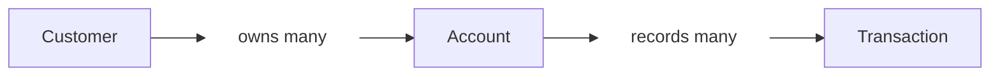

<div align="center">


# Paper Maker Banking App

**Python · FastAPI · MongoDB Atlas**

Backend REST API with a MongoDB Atlas database

[Setup](#run-it-locally) · [Atlas](#connect-to-mongodb-atlas) · [Example](#a-small-banking-session) · [Endpoints](#the-api-at-a-glance) · [Initialization](#steps-to-initialize-this-branch-of-the-app)

</div>

---

Paper Maker Banking App is a FastAPI backend for managing customers and their
accounts. It supports deposits, withdrawals, a transaction history for each
account, customer search with balance categories, low/high balance alerts, and a
transaction audit. Customers, accounts, transactions, and alerts are stored in
MongoDB Atlas, so data survives a server restart.

One customer can open several accounts. Each account starts at zero, and every
successful deposit or withdrawal leaves a transaction record. Routes, services,
and repositories handle HTTP requests, business rules, and storage respectively.

> **A note about security:** there is no login in this milestone. Anyone who can
> reach the API can read and change any record, and the audit cursor described
> below is not signed. Do not expose the server to an untrusted network.

## A small banking session

Example requests against a new account:

| Action | Money in | Money out | Balance |
| :--- | ---: | ---: | ---: |
| Open Moataz Hikal's savings account | — | — | 0.00 |
| Make a deposit | 100.00 | — | 100.00 |
| Make a withdrawal | — | 25.00 | 75.00 |
| Try to withdraw 76.00 | — | Rejected | 75.00 |

That last request returns **400: Insufficient funds**. It does not change the
balance or add a transaction. The [Postman collection](postman/Banking-App.postman_collection.json)
walks through this example, an idempotent deposit retry, customer search, alerts,
the audit, customer/account edits, a second account, and cleanup.

## Run it locally

You will need **Python 3.12** (the version this branch was built and tested
on), Git, and a MongoDB Atlas cluster (see the next section).

```sh
git clone --branch 2_api-with-db-integration-mongodb-cloud-atlas https://github.com/RootMoataz/Paper-Maker-Banking-App.git
cd Paper-Maker-Banking-App
python -m venv .venv
```

Activate the environment:

| Your terminal | Command |
| :--- | :--- |
| Windows PowerShell | `.venv\Scripts\Activate.ps1` |
| macOS / Linux | `source .venv/bin/activate` |

Then install the requirements and start the API (after creating the `.env`
described below):

```sh
python -m pip install -r requirements.txt
python -m uvicorn app.main:app --reload
```

Open **[Swagger UI](http://127.0.0.1:8000/docs)**, expand an endpoint, and choose
**Try it out**. The OpenAPI schema is at `/openapi.json`; ReDoc is at `/redoc`.

<details>
<summary>PowerShell won't activate the environment?</summary>

You can run Python directly from the environment without changing your execution
policy:

```powershell
.venv\Scripts\python.exe -m pip install -r requirements.txt
.venv\Scripts\python.exe -m uvicorn app.main:app --reload
```

</details>

## Connect to MongoDB Atlas

Create a `.env` file in the project root (next to `requirements.txt`). It is
listed in `.gitignore`; never commit it, because the connection string contains
your database password.

```sh
MONGODB_URI=<your Atlas connection string>
MONGODB_DB=paper_maker
# LOW_BALANCE_THRESHOLD=100.00
# PREMIUM_BALANCE_THRESHOLD=10000.00
```

Only `MONGODB_URI` is required. The two threshold lines are optional and shown
commented out with their defaults: delete the `#` to change a value, and leave a
line out (never empty and never a placeholder) to use its default. An empty or
invalid value stops the app from starting.

| Setting | Meaning |
| :--- | :--- |
| `MONGODB_URI` | Required. The app and the tests refuse to start without it. |
| `MONGODB_DB` | Database name. Defaults to `paper_maker`. |
| `LOW_BALANCE_THRESHOLD` | Defaults to `100.00`. An amount from 0.00 to 99999999.99 with at most two decimals. |
| `PREMIUM_BALANCE_THRESHOLD` | Defaults to `10000.00`. Must be larger than the low threshold. |

Environment variables set in the shell take precedence over the `.env` file.
The `.env` is found relative to the code, so it works from any directory.

Deposits, withdrawals, account creation and deletion, and customer edits and
deletion run in MongoDB transactions, so use Atlas or another replica set (MongoDB
transactions need a replica set; only Atlas was used and tested here).

The app creates its indexes at startup (`emailKey` uniqueness, the account-owner
lookup, the transaction lookups, the idempotency index, and the alert lookup), and
this is safe to repeat.
To create them ahead of time, run this once with the `.env` in place:

```sh
python scripts/setup_indexes.py
```

It prints the index names of the `customers`, `accounts`, `transactions`, and
`alerts` collections.

## The API at a glance

All paths start with `/api`. Customer and account IDs come from the API and are
24-character hexadecimal strings; use the returned IDs in later requests. A
malformed ID returns 422, and a well-formed ID that does not exist returns 404
(in a path; the alerts and audit filters return an empty result instead).

### Customers

| Method | Path | What it does | Success |
| :--- | :--- | :--- | :--- |
| GET | `/customers` | Get all customers, oldest first | 200 |
| POST | `/customers` | Create a customer | 201 |
| GET | `/customers/search` | Search customers by name, email, category, or total balance | 200 |
| GET | `/customers/{id}` | Find one customer | 200 |
| PUT | `/customers/{id}` | Replace their name and email | 200 |
| DELETE | `/customers/{id}` | Delete a customer who has no accounts | 204 |
| GET | `/customers/{id}/accounts` | List the accounts they own | 200 |

Create or edit a customer with both fields:

```json
{
  "name": "Moataz Hikal",
  "email": "moataz@example.com"
}
```

Names cannot be blank. Emails must be valid and unique, ignoring letter case.
Editing a customer's name also updates the name shown on their accounts.

#### Search and balance categories

`GET /api/customers/search` accepts these optional query parameters; filters
combine, and results come back oldest customer first.

| Parameter | Meaning |
| :--- | :--- |
| `name`, `email` | Case-insensitive substring, up to 100 characters. Characters such as `.` match themselves. |
| `category` | `LOW`, `STANDARD`, or `PREMIUM` |
| `minBalance`, `maxBalance` | Bounds on the customer's total balance, both inclusive |
| `limit` | 1 to 200, default 50 |

A customer's total is the sum of all their accounts (0.00 with none). Each result
shows `customerId`, `name`, `email`, `totalBalance`, and `category`.

| Category | Rule with the default thresholds |
| :--- | :--- |
| `LOW` | total below 100.00 |
| `STANDARD` | total from 100.00 up to, but not including, 10000.00 |
| `PREMIUM` | total of 10000.00 or more |

So exactly 100.00 is `STANDARD` and exactly 10000.00 is `PREMIUM`. The thresholds
come from `LOW_BALANCE_THRESHOLD` and `PREMIUM_BALANCE_THRESHOLD`.

### Accounts and money

| Method | Path | What it does | Success |
| :--- | :--- | :--- | :--- |
| GET | `/accounts` | Get all accounts | 200 |
| POST | `/accounts` | Open an account for an existing customer | 201 |
| GET | `/accounts/{id}` | Get account details and balance | 200 |
| PUT | `/accounts/{id}` | Change the account type | 200 |
| DELETE | `/accounts/{id}` | Delete an account with a zero balance | 204 |
| POST | `/accounts/{id}/deposit` | Add money | 200 |
| POST | `/accounts/{id}/withdraw` | Take money out | 200 |
| GET | `/accounts/{id}/transactions` | Get transaction history, oldest first | 200 |

Open an account using the `customerId` returned when you created the customer:

```json
{
  "customerId": "66f9a1b2c3d4e5f6a7b8c9d0",
  "accountType": "SAVINGS"
}
```

An account edit takes only `{"accountType":"CURRENT"}`. Types are nonblank
strings up to 50 characters, such as SAVINGS or CURRENT.
Ownership cannot be reassigned, and balance changes go through deposit or
withdrawal rather than account edits.

Both money operations take the same body:

```json
{
  "amount": "25.00"
}
```

JSON numbers are accepted too. Money is stored as whole cents and comes back as
a decimal string, which keeps values such as `0.10 + 0.20` exact.

<details>
<summary>Example account response after the banking session</summary>

```json
{
  "accountId": "66f9a1b2c3d4e5f6a7b8c9d1",
  "customerId": "66f9a1b2c3d4e5f6a7b8c9d0",
  "userId": "66f9a1b2c3d4e5f6a7b8c9d0",
  "userName": "Moataz Hikal",
  "accountType": "SAVINGS",
  "balance": "75.00",
  "createdAt": "2026-09-29T12:00:00Z"
}
```

`customerId` and `userId` refer to the same person. Use `customerId` with the
customer endpoints. `userId` and `POST /api/users` are kept for compatibility
with the original API contract.

</details>

#### Idempotency keys

Deposit and withdraw accept an optional `Idempotency-Key` header (1 to 200
printable ASCII characters). It lets a client retry after a lost response
without moving money twice.

| Request | Result |
| :--- | :--- |
| No key | Every request is a new operation; two identical keyless deposits both apply. |
| Key used for the first time | The operation runs; if it succeeds, it is recorded with the key (a failed attempt records nothing, so a retry runs again). |
| Same key, same account, same operation and amount | The first result is replayed. The balance does not change and no transaction or alert is added. |
| Same key and account, different operation or amount | **409** |
| Same key on another account | Independent; it runs as a new operation. |

Keys are scoped to one account and never expire. A replayed Account response
shows the balance right after the original operation, but the account's current
`accountType` and owner name. If the account has been deleted since, the replay
returns the original transaction record instead.

### Alerts

`GET /api/alerts` lists in-app alert records, newest first. Optional query
parameters: `customerId` and `limit` (1 to 200, default 50). An alert is written
only when a deposit or withdrawal moves a customer's total across a threshold:

| Type | Written when the total goes (default thresholds) | Fields |
| :--- | :--- | :--- |
| `LOW_BALANCE` | from 100.00 or more to below 100.00 | `alertId`, `customerId`, `accountId`, `transactionId`, `type`, `totalBalance`, `threshold`, `createdAt` |
| `HIGH_BALANCE` | from below 10000.00 to 10000.00 or more | same |

Staying on one side of a threshold, or replaying an idempotent request, writes
nothing. An alert is stored in the same database transaction as the balance
change that caused it, and alerts are kept after their customer is deleted.

### Audit

`GET /api/audit/transactions` returns the deposits and withdrawals of a customer
(across all their accounts) or of one account, oldest first, then by `txnId`.
It is read page by page.

| Parameter | Meaning |
| :--- | :--- |
| `customerId`, `accountId` | At least one is required (both may be given); otherwise 422 |
| `from` | Start time, inclusive, ISO 8601 |
| `to` | End time, exclusive, ISO 8601 |
| `limit` | 1 to 200, default 50 |
| `cursor` | The previous page's `nextCursor` |

The response is `{"items": [...], "nextCursor": "..."}`; `nextCursor` is `null` on
the last page. To read the next page, send the same filters with `cursor` set.

```text
GET /api/audit/transactions?customerId=66f9a1b2c3d4e5f6a7b8c9d0&from=2026-09-01T00:00:00Z&limit=50
```

- A time without an offset is read as UTC. Write `Z` in URLs, or encode a `+`
  offset as `%2B02:00`: a bare `+` in a query string becomes a space and is
  rejected with 422.
- Transactions survive deleting their account and customer, so deleted IDs
  still return their history, and no existence check is made for either ID.
- A cursor is tied to the filters it was issued for. Writing the same filters
  differently (ID letter case, `Z` versus `+00:00`) is accepted; a cursor used
  with different filters, or a malformed one, returns 422. `limit` may change
  between pages.
- The cursor is not signed. There is no login in this milestone, so it only
  guards against mixing up filters, not against forgery.
- Order comes from the stored time and the transaction ID. Within one account,
  the app keeps each new record later than the previous one. Across accounts,
  exact ordering assumes one app server or synchronized server clocks.

## The rules behind the responses

| Situation | Result |
| :--- | :--- |
| Deposit or withdrawal is zero, negative, non-finite, or has fractions of a cent | **422** |
| Withdrawal is larger than the balance | **400** |
| Deposit would push the balance above 99,999,999.99 | **400** |
| Customer or account does not exist | **404** |
| Email already belongs to a customer | **409** |
| Customer still owns accounts when deletion is requested | **409** |
| Account still has money when deletion is requested | **409** |
| Idempotency key reused for a different operation or amount | **409** |
| Required fields are missing, extra fields are supplied, or JSON/IDs/parameters are invalid | **422** |
| Audit request without `customerId` or `accountId`, or with a bad or mismatched cursor | **422** |

Amounts are limited to 99,999,999.99. Larger input amounts return 422.
Business errors return `{"detail":"message"}`. A 422 has two shapes: business
errors in the audit (missing IDs, cursor problems, out-of-range times) carry a
string `detail`, while request validation errors (bad body, ID, or query
parameter) carry FastAPI's `detail` list with the affected fields.

A successful deposit or withdrawal records `txnId`, `accountId`, `customerId`,
`type`, `amount`, `balanceAfter`, and `date` in UTC. New accounts have an empty
history. Failed operations leave the balance, history, and alerts untouched.

For deletion, work from the account back to the customer: withdraw any remaining
balance, delete the accounts, then delete the customer. Successful deletes return
204 with no body. **Transactions are kept** after their account or customer is
deleted, and the audit still returns them; the account's own
`/accounts/{id}/transactions` route returns 404 once the account is gone.
Deleting an account requires a balance of exactly 0.00, and deleting a customer
requires that they have no accounts. Deleted IDs are never reused.

## Current Architecture of the Branch

### Record Relationships

One customer can own multiple accounts, and each account can have multiple transactions.



### Code Structure

The files below handle requests, business rules, storage, validation, and tests.

| File | Responsibility |
| :--- | :--- |
| [`app/main.py`](app/main.py) | HTTP routes, response codes, and Swagger descriptions |
| [`app/models.py`](app/models.py) | Request validation and response fields |
| [`app/services.py`](app/services.py) | Customer/account operations, money rules, idempotency, search, alerts, and audit |
| [`app/repositories.py`](app/repositories.py) | MongoDB reads and writes for customers, accounts, transactions, and alerts |
| [`app/audit.py`](app/audit.py) | Audit cursors and the filter fingerprint |
| [`app/config.py`](app/config.py) | Settings from the environment and `.env` |
| [`app/db.py`](app/db.py) | MongoDB connection and index creation |
| [`app/money.py`](app/money.py) | Conversion between decimal amounts and whole cents |
| [`scripts/setup_indexes.py`](scripts/setup_indexes.py) | Creates the indexes ahead of time |
| [`tests/`](tests/) | Behavior checks, including the collection workflow |

Requests move from route to service to repository. `CustomerService` handles
customer CRUD and search; `AccountService` handles accounts, deposits,
withdrawals, history, alerts, and the audit. A balance change, its transaction
record, and any alert are written in one MongoDB transaction; the balance check
and update are a single database operation, so two withdrawals cannot spend the
same money.

The [dependency map](docs/dependencies.md) shows the record relationships and
explains why accounts must be deleted before their customer.

## Steps to initialize this branch of the App

```sh
python -m pip install -r requirements-dev.txt
python -m pytest -q -p no:cacheprovider
```

The tests need `MONGODB_URI` (from the environment or the `.env`). Without it
they **fail** rather than skip. They create a throwaway database named
`paper_maker_test_<hex>` on that cluster and drop it at the end; the fixtures
refuse to clear any database whose name does not start with `paper_maker_test_`.
Thresholds are pinned to the defaults, so a local `.env` does not change results.
A full run takes a few minutes against Atlas.

The suite contains **246 tests**:

| File | Tests | Coverage |
| :--- | ---: | :--- |
| `test_api.py` | 46 | Money operations, rejected requests, history, and concurrent withdrawals |
| `test_crud.py` | 35 | Customer/account CRUD, ownership, email uniqueness, deletion, and API schemas |
| `test_idempotency.py` | 29 | Idempotency keys, replays, key validation, and concurrent retries |
| `test_search_alerts.py` | 47 | Search, category boundaries, threshold-crossing alerts, and concurrent alerts |
| `test_audit.py` | 65 | Audit filters, time bounds, cursor paging, and cursor validation |
| `test_foundation.py` | 23 | Money conversion, settings, and indexes |
| `test_postman_collection.py` | 1 | The collection's requests in their saved order |

`requirements-lock.txt` records the tested dependency versions. Install it instead
of `requirements-dev.txt` to use those exact versions.

For a walkthrough, follow the [Swagger test steps](docs/swagger-testing.md), or
import the [Postman collection](postman/Banking-App.postman_collection.json) and run
it in its stored order. The collection creates a fresh email, captures IDs, and
deletes its sample customer and accounts at the end (their transactions and alert
are kept by design). Its search and alert checks assume the default thresholds.

The tests send requests directly to the app through FastAPI's TestClient. They
check the Postman request sequence and the Swagger schema, but do not launch
either application's interface. See [test coverage](docs/swagger-testing.md#test-coverage)
for the checks performed and their limits.
