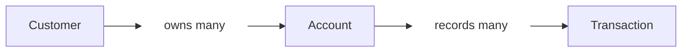

<div align="center">


# Paper Maker Banking App

**Python · FastAPI · In-memory storage**

Backend REST API Without DB

[Setup](#run-it-locally) · [Example](#a-small-banking-session) · [Endpoints](#the-api-at-a-glance) · [Initialization](#steps-to-initialize-this-branch-of-the-app)

</div>

---

Paper Maker Banking App is a FastAPI backend for managing customers and their
accounts. It supports deposits, withdrawals, and a transaction history for each
account. Customer, account, and transaction records live in memory, so the app
runs without a database connection.

One customer can open several accounts. Each account starts at zero, and every
successful deposit or withdrawal leaves a transaction record. The controllers,
services, and repositories handle HTTP requests, business rules, and storage
respectively.

> **A note about memory:** restarting the server clears the data. Start the API
> once with the command below and use sample customers. It runs as a single server
> process, so all requests use the same in-memory records. Multiple server processes
> would each have separate records. There is no login or persistent storage.

## A small banking session

Example requests against a new account:

| Action | Money in | Money out | Balance |
| :--- | ---: | ---: | ---: |
| Open Moataz Hikal's savings account | — | — | 0.00 |
| Make a deposit | 100.00 | — | 100.00 |
| Make a withdrawal | — | 25.00 | 75.00 |
| Try to withdraw 76.00 | — | Rejected | 75.00 |

That last request returns **400: Insufficient funds**. It does not change the
balance or add a transaction. The [Postman collection](postman/Banking-App.postman_collection.json)
walks through this example, customer/account edits, a second account, and cleanup.

## Run it locally

You will need **Python 3.10 or newer** and Git.

```sh
git clone --branch 1_backend-rest-api-without-db https://github.com/RootMoataz/Paper-Maker-Banking-App.git
cd Paper-Maker-Banking-App
python -m venv .venv
```

Activate the environment:

| Your terminal | Command |
| :--- | :--- |
| Windows PowerShell | `.venv\Scripts\Activate.ps1` |
| macOS / Linux | `source .venv/bin/activate` |

Then install the requirements and start the API:

```sh
python -m pip install -r requirements.txt
python -m uvicorn app.main:app --reload
```

Open **[Swagger UI](http://127.0.0.1:8000/docs)**, expand an endpoint, and choose
**Try it out**. The OpenAPI schema is at `/openapi.json`; ReDoc is at `/redoc`.
Saving a code change while `--reload` is running also resets the in-memory data.

<details>
<summary>PowerShell won't activate the environment?</summary>

You can run Python directly from the environment without changing your execution
policy:

```powershell
.venv\Scripts\python.exe -m pip install -r requirements.txt
.venv\Scripts\python.exe -m uvicorn app.main:app --reload
```

</details>

## The API at a glance

All paths start with `/api`. Customer and account IDs come from the API; use the
returned IDs in later requests.

### Customers

| Method | Path | What it does | Success |
| :--- | :--- | :--- | :--- |
| GET | `/customers` | Get all customers | 200 |
| POST | `/customers` | Create a customer | 201 |
| GET | `/customers/{id}` | Find one customer | 200 |
| PUT | `/customers/{id}` | Replace their name and email | 200 |
| DELETE | `/customers/{id}` | Delete a customer who has no accounts | 204 |
| GET | `/customers/{id}/accounts` | List the accounts they own | 200 |

Create or edit a customer with both fields:

```json
{
  "name": "Moataz Hikal",
  "email": "moataz@example.com"
}
```

Names cannot be blank. Emails must be valid and unique, ignoring letter case.
Editing a customer's name also updates the name shown on their accounts.

### Accounts and money

| Method | Path | What it does | Success |
| :--- | :--- | :--- | :--- |
| GET | `/accounts` | Get all accounts | 200 |
| POST | `/accounts` | Open an account for an existing customer | 201 |
| GET | `/accounts/{id}` | Get account details and balance | 200 |
| PUT | `/accounts/{id}` | Change the account type | 200 |
| DELETE | `/accounts/{id}` | Delete an account with a zero balance | 204 |
| POST | `/accounts/{id}/deposit` | Add money | 200 |
| POST | `/accounts/{id}/withdraw` | Take money out | 200 |
| GET | `/accounts/{id}/transactions` | Get transaction history, oldest first | 200 |

Open an account using the `customerId` returned when you created the customer:

```json
{
  "customerId": 1,
  "accountType": "SAVINGS"
}
```

An account edit takes only `{"accountType":"CURRENT"}`. Types are nonblank
strings up to 50 characters, such as SAVINGS or CURRENT.
Ownership cannot be reassigned, and balance changes go through deposit or
withdrawal rather than account edits.

Both money operations take the same body:

```json
{
  "amount": "25.00"
}
```

JSON numbers are accepted too. Money uses Python's `Decimal` and comes back as
a decimal string, which keeps values such as `0.10 + 0.20` exact.

<details>
<summary>Example account response after the banking session</summary>

```json
{
  "accountId": 1,
  "customerId": 1,
  "userId": 1,
  "userName": "Moataz Hikal",
  "accountType": "SAVINGS",
  "balance": "75.00",
  "createdAt": "2026-09-29T12:00:00Z"
}
```

`customerId` and `userId` refer to the same person. Use `customerId` with the
customer endpoints. `userId` and `POST /api/users` are kept for compatibility
with the original API contract.

</details>

## The rules behind the responses

| Situation | Result |
| :--- | :--- |
| Deposit or withdrawal is zero, negative, non-finite, or has fractions of a cent | **422** |
| Withdrawal is larger than the balance | **400** |
| Deposit would push the balance above 99,999,999.99 | **400** |
| Customer or account does not exist | **404** |
| Email already belongs to a customer | **409** |
| Customer still owns accounts when deletion is requested | **409** |
| Account still has money when deletion is requested | **409** |
| Required fields are missing, extra fields are supplied, or JSON/IDs are invalid | **422** |

Amounts are limited to 99,999,999.99, matching the brief's `DECIMAL(10,2)` field.
Larger input amounts return 422. Business errors return `{"detail":"message"}`;
validation errors return FastAPI's `detail` array with the affected fields.

A successful deposit or withdrawal records `txnId`, `accountId`, `type`, `amount`,
and `date` in UTC. New accounts have an empty history. Failed operations leave
both the balance and history untouched.

For deletion, work from the account back to the customer: withdraw any remaining
balance, delete the accounts, then delete the customer. Successful deletes return
204 with no body. Account deletion also removes its history in this in-memory
exercise. Deleted IDs are never reused during the same server run.

## Current Architecture of the Branch

### Record Relationships

One customer can own multiple accounts, and each account can have multiple transactions.



### Code Structure

The files below handle requests, business rules, storage, validation, and tests.

| File | Responsibility |
| :--- | :--- |
| [`app/main.py`](app/main.py) | HTTP routes, response codes, and Swagger descriptions |
| [`app/models.py`](app/models.py) | Request validation and response fields |
| [`app/services.py`](app/services.py) | Customer/account operations and money rules |
| [`app/repositories.py`](app/repositories.py) | In-memory records and ID counters |
| [`tests/`](tests/) | Behavior checks, including the collection workflow |

Requests move from controller to service to repository. `CustomerService` handles
customer CRUD; `AccountService` handles accounts, deposits, withdrawals, and
history. A shared lock keeps concurrent balance checks and updates together.
Each application instance gets its own store.

The [dependency map](docs/dependencies.md) shows the record relationships and
explains why accounts must be deleted before their customer.

## Steps to initialize this branch of the App

```sh
python -m pip install -r requirements-dev.txt
python -m pytest -q
```

The suite contains **62 tests**:

| File | Tests | Coverage |
| :--- | ---: | :--- |
| `test_api.py` | 38 | Money operations, rejected requests, history, and concurrent withdrawals |
| `test_crud.py` | 23 | Customer/account CRUD, ownership, email uniqueness, deletion, and API schemas |
| `test_postman_collection.py` | 1 | The collection's 21 requests in their saved order |

`requirements-lock.txt` records the tested dependency versions. Install it instead
of `requirements-dev.txt` to use those exact versions.

For a walkthrough, follow the [Swagger test steps](docs/swagger-testing.md), or
import the [Postman collection](postman/Banking-App.postman_collection.json) and run
it in its stored order. The collection creates a fresh email, captures IDs, and
cleans up its sample records at the end.

The tests send requests directly to the app through FastAPI's TestClient. They
check the Postman request sequence and the Swagger schema, but do not launch
either application's interface. See [test coverage](docs/swagger-testing.md#test-coverage)
for the checks performed and their limits.
