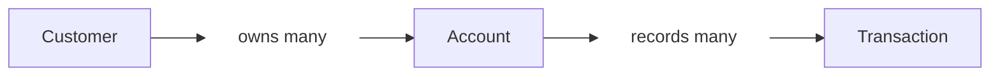

<div align="center">


# Paper Maker Banking App

**Python · FastAPI · MongoDB Atlas**

Backend REST API with a MongoDB Atlas database

[Setup](#run-it-locally) · [Atlas](#connect-to-mongodb-atlas) · [Example](#a-small-banking-session) · [Endpoints](#the-api-at-a-glance) · [Initialization](#steps-to-initialize-this-branch-of-the-app)

</div>

---

Paper Maker Banking App is a FastAPI backend for managing customers and their
accounts. It supports deposits, withdrawals, transfers between any two accounts,
a transaction history for each account, a premium-accounts list, customer search
with balance categories, category-change notifications with a marketing opt-in,
and a transaction audit. Customers, accounts,
transactions, and notifications are stored in MongoDB Atlas, so data survives a
server restart.

One customer can open several accounts. Each account starts at zero, and every
successful deposit or withdrawal leaves a transaction record. Routes, services,
and repositories handle HTTP requests, business rules, and storage respectively.

> **A note about security:** there is no login in this milestone. Anyone who can
> reach the API can read and change any record, and the audit cursor described
> below is not signed. Do not expose the server to an untrusted network.

## A small banking session

Example requests against a new account:

| Action | Money in | Money out | Balance |
| :--- | ---: | ---: | ---: |
| Open Moataz Hikal's savings account | — | — | 0.00 |
| Make a deposit | 100.00 | — | 100.00 |
| Make a withdrawal | — | 25.00 | 75.00 |
| Try to withdraw 76.00 | — | Rejected | 75.00 |

That last request returns **400: Insufficient funds**. It does not change the
balance or add a transaction. The [Postman collection](postman/Banking-App.postman_collection.json)
walks through this example, an idempotent deposit retry, customer search, a
marketing opt-in and the notifications it produces, the audit, customer/account edits, a second account, an
idempotent transfer between the two accounts, the premium-accounts list, and cleanup that deletes the customer
together with their remaining account.

## Run it locally

You will need **Python 3.12** (the version this branch was built and tested
on), Git, and a MongoDB Atlas cluster (see the next section).

```sh
git clone --branch 2_api-with-db-integration-mongodb-cloud-atlas https://github.com/RootMoataz/Paper-Maker-Banking-App.git
cd Paper-Maker-Banking-App
python -m venv .venv
```

Activate the environment:

| Your terminal | Command |
| :--- | :--- |
| Windows PowerShell | `.venv\Scripts\Activate.ps1` |
| macOS / Linux | `source .venv/bin/activate` |

Then install the requirements and start the API (after creating the `.env`
described below):

```sh
python -m pip install -r requirements.txt
python -m uvicorn app.main:app --reload
```

Open **[Swagger UI](http://127.0.0.1:8000/docs)**, expand an endpoint, and choose
**Try it out**. The OpenAPI schema is at `/openapi.json`; ReDoc is at `/redoc`.

<details>
<summary>PowerShell won't activate the environment?</summary>

You can run Python directly from the environment without changing your execution
policy:

```powershell
.venv\Scripts\python.exe -m pip install -r requirements.txt
.venv\Scripts\python.exe -m uvicorn app.main:app --reload
```

</details>

## Connect to MongoDB Atlas

Create a `.env` file in the project root (next to `requirements.txt`). It is
listed in `.gitignore`; never commit it, because the connection string contains
your database password.

```sh
MONGODB_URI=<your Atlas connection string>
MONGODB_DB=paper_maker
# LOW_BALANCE_THRESHOLD=100.00
# PREMIUM_BALANCE_THRESHOLD=10000.00
# CORS_ALLOWED_ORIGINS=http://localhost:3000,http://localhost:5173
```

Only `MONGODB_URI` is required. The commented lines are optional and shown
commented out with their defaults: delete the `#` to change a value, and leave a
line out (never empty and never a placeholder) to use its default. An empty or
invalid value stops the app from starting.

| Setting | Meaning |
| :--- | :--- |
| `MONGODB_URI` | Required. The app and the tests refuse to start without it. |
| `MONGODB_DB` | Database name. Defaults to `paper_maker`. |
| `LOW_BALANCE_THRESHOLD` | Defaults to `100.00`. An amount from 0.00 to 99999999.99 with at most two decimals. |
| `PREMIUM_BALANCE_THRESHOLD` | Defaults to `10000.00`. Must be larger than the low threshold. Also the default `threshold` of the premium-accounts list. |
| `CORS_ALLOWED_ORIGINS` | Browser origins allowed to call the API, comma-separated, such as `http://localhost:3000`: scheme, host and optional port, with no path, trailing slash or `*`. Defaults to `http://localhost:3000,http://localhost:5173`. |

CORS lets a browser frontend on one of those origins call the API. Any method is
allowed, the `Content-Type` and `Idempotency-Key` request headers are allowed, and
no cookies or credentials are used. A request from any other origin gets no CORS
headers, so the browser blocks it (tools such as Postman or curl are not affected).

Environment variables set in the shell take precedence over the `.env` file. The `.env` is read
without being copied into the process environment, so child processes do not inherit the connection string.
The `.env` is found relative to the code, so it works from any directory.

Deposits, withdrawals, transfers, account creation and deletion, and customer edits and
deletion run in MongoDB transactions, so use Atlas or another replica set (MongoDB
transactions need a replica set; only Atlas was used and tested here).

The app creates its indexes at startup (`emailKey` uniqueness, the account-owner
lookup, the account balance order for the premium list, the transaction lookups,
the idempotency index, the transfer-leg lookup, and the notification lookup and
its unique key), and this is safe to repeat.
To create them ahead of time, run this once with the `.env` in place:

```sh
python scripts/setup_indexes.py
```

It prints the index names of the `customers`, `accounts`, `transactions`, and
`notifications` collections.

## The API at a glance

All paths start with `/api`. Customer and account IDs come from the API and are
24-character hexadecimal strings; use the returned IDs in later requests. A
malformed ID returns 422, and a well-formed ID that does not exist returns 404
(in a path; the audit filters return an empty result instead).

### Customers

| Method | Path | What it does | Success |
| :--- | :--- | :--- | :--- |
| GET | `/customers` | Get all customers, oldest first | 200 |
| POST | `/customers` | Create a customer | 201 |
| GET | `/customers/search` | Search customers by name, email, category, or total balance | 200 |
| GET | `/customers/{id}` | Find one customer | 200 |
| PUT | `/customers/{id}` | Replace their name and email | 200 |
| DELETE | `/customers/{id}` | Delete a customer and all their accounts | 204 |
| GET | `/customers/{id}/accounts` | List the accounts they own | 200 |
| PATCH | `/customers/{id}/preferences` | Opt in to or out of marketing messages | 200 |
| GET | `/customers/{id}/notifications` | List their stored messages, newest first | 200 |

Create or edit a customer with both fields:

```json
{
  "name": "Moataz Hikal",
  "email": "moataz@example.com"
}
```

Names cannot be blank. Emails must be valid and unique, ignoring letter case.
Editing a customer's name also updates the name shown on their accounts. Customer
responses also show `marketingEnabled` (see [Notifications](#notifications)).

#### Search and balance categories

`GET /api/customers/search` accepts these optional query parameters; filters
combine, and results come back oldest customer first.

| Parameter | Meaning |
| :--- | :--- |
| `name`, `email` | Case-insensitive substring, up to 100 characters. Characters such as `.` match themselves. |
| `category` | `LOW`, `STANDARD`, or `PREMIUM` |
| `minBalance`, `maxBalance` | Bounds on the customer's total balance, both inclusive |
| `limit` | 1 to 200, default 50 |

A customer's total is the sum of all their accounts (0.00 with none). Each result
shows `customerId`, `name`, `email`, `totalBalance`, and `category`.

| Category | Rule with the default thresholds |
| :--- | :--- |
| `LOW` | total below 100.00 |
| `STANDARD` | total from 100.00 up to, but not including, 10000.00 |
| `PREMIUM` | total of 10000.00 or more |

So exactly 100.00 is `STANDARD` and exactly 10000.00 is `PREMIUM`. The thresholds
come from `LOW_BALANCE_THRESHOLD` and `PREMIUM_BALANCE_THRESHOLD`.

### Accounts and money

| Method | Path | What it does | Success |
| :--- | :--- | :--- | :--- |
| GET | `/accounts` | Get all accounts | 200 |
| POST | `/accounts` | Open an account for an existing customer | 201 |
| GET | `/accounts/premium` | List accounts at or above a balance, highest first | 200 |
| GET | `/accounts/{id}` | Get account details and balance | 200 |
| PUT | `/accounts/{id}` | Change the account type | 200 |
| DELETE | `/accounts/{id}` | Delete an account with a zero balance | 204 |
| POST | `/accounts/{id}/deposit` | Add money | 200 |
| POST | `/accounts/{id}/withdraw` | Take money out | 200 |
| GET | `/accounts/{id}/transactions` | Get transaction history, oldest first | 200 |
| POST | `/transfers` | Move money from one account to another | 200 |

`GET /customers`, `GET /accounts` and `GET /accounts/{id}/transactions` accept an optional
`limit` query parameter (1 to 200). With it, only the first `limit` items are returned;
without it, everything is returned as before. Values outside 1 to 200 give 422.

Open an account using the `customerId` returned when you created the customer:

```json
{
  "customerId": "66f9a1b2c3d4e5f6a7b8c9d0",
  "accountType": "SAVINGS"
}
```

An account edit takes only `{"accountType":"CURRENT"}`. Types are nonblank
strings up to 50 characters, such as SAVINGS or CURRENT.
Ownership cannot be reassigned, and balance changes go through deposit or
withdrawal rather than account edits.

Both money operations take the same body:

```json
{
  "amount": "25.00"
}
```

JSON numbers are accepted too. Money is stored as whole cents and comes back as
a decimal string, which keeps values such as `0.10 + 0.20` exact.

<details>
<summary>Example account response after the banking session</summary>

```json
{
  "accountId": "66f9a1b2c3d4e5f6a7b8c9d1",
  "customerId": "66f9a1b2c3d4e5f6a7b8c9d0",
  "userId": "66f9a1b2c3d4e5f6a7b8c9d0",
  "userName": "Moataz Hikal",
  "accountType": "SAVINGS",
  "balance": "75.00",
  "createdAt": "2026-09-29T12:00:00Z"
}
```

`customerId` and `userId` refer to the same person. Use `customerId` with the
customer endpoints. `userId` and `POST /api/users` are kept for compatibility
with the original API contract.

</details>

#### Idempotency keys

Deposit and withdraw accept an optional `Idempotency-Key` header (1 to 200
printable ASCII characters, not starting with a space). It lets a client retry after a lost response
without moving money twice.

| Request | Result |
| :--- | :--- |
| No key | Every request is a new operation; two identical keyless deposits both apply. |
| Key used for the first time | The operation runs; if it succeeds, it is recorded with the key (a failed attempt records nothing, so a retry runs again). |
| Same key, same account, same operation and amount | The first result is replayed. The balance does not change and no transaction or notification is added. |
| Same key and account, different operation or amount | **409** |
| Same key on another account | Independent; it runs as a new operation. |

Keys are scoped to one account and never expire. A replayed Account response
shows the balance right after the original operation, but the account's current
`accountType` and owner name. If the account has been deleted since, the replay
returns the original transaction record instead. That is a different shape: it has
`balanceAfter` (the balance right after the operation) and no `balance`, so a client that
retries a deposit or withdrawal should accept either an Account or a Transaction.

#### Transfers

`POST /api/transfers` moves money between any two different accounts, of the
same customer or of different customers:

```json
{
  "fromAccountId": "66f9a1b2c3d4e5f6a7b8c9d1",
  "toAccountId": "66f9a1b2c3d4e5f6a7b8c9d2",
  "amount": "25.00"
}
```

The amount follows the deposit rules (positive, at most two decimals, at most
99,999,999.99), and no other fields are accepted. One database transaction
debits the source, credits the destination, and writes one record to each
account's history, so either everything happens or nothing does.

| Situation | Result |
| :--- | :--- |
| Success | **200** with the transfer below |
| `fromAccountId` and `toAccountId` are the same account | **422** `fromAccountId and toAccountId must be different accounts` |
| Source or destination does not exist | **404** `Source account not found` / `Destination account not found` |
| Source balance is smaller than the amount (no overdraft) | **400** `Insufficient funds` |
| Destination would go above 99,999,999.99 | **400** `Balance would exceed 99999999.99` |
| `Idempotency-Key` reused for a different request | **409** |

```json
{
  "transferId": "66f9a1b2c3d4e5f6a7b8c9e0",
  "fromAccountId": "66f9a1b2c3d4e5f6a7b8c9d1",
  "toAccountId": "66f9a1b2c3d4e5f6a7b8c9d2",
  "amount": "25.00",
  "fromBalanceAfter": "50.00",
  "toBalanceAfter": "25.00",
  "date": "2026-09-29T12:05:00Z"
}
```

The source account's history gets a `TRANSFER_OUT` record and the destination's
a `TRANSFER_IN` record. Both carry the shared `transferId`, `fromAccountId`, and
`toAccountId`; each has its own `txnId`, the `customerId` of its account's owner,
and the `balanceAfter` of its own account. `date` in the response is the
`TRANSFER_OUT` record's date. Two records, rather than one, keep each account's
history and the audit (by account or by customer) complete with a running
balance.

The optional `Idempotency-Key` header works as for a withdrawal: the key is
scoped to the source account (and shares that account's keys with deposits and
withdrawals). Resending the same transfer (same source, destination, and
amount) replays the first response, built from the stored records, even after
either account has been deleted; anything else with that key returns 409.

Notifications are computed per customer: the source owner's total falls by the
amount and the destination owner's total rises by it, and each customer whose
category changes gets the usual messages, citing their own record. A transfer
between one customer's own accounts leaves their total unchanged, so it stores
no notification.

#### Premium accounts

`GET /api/accounts/premium` lists accounts whose own balance is at least
`threshold`, highest balance first (equal balances: oldest account first).

| Parameter | Meaning |
| :--- | :--- |
| `threshold` | Inclusive, from 0 up to 99999999.99 with at most two decimals. Defaults to `PREMIUM_BALANCE_THRESHOLD` (10000.00 unless configured). |
| `limit` | 1 to 200, default 50 |

Each result is an ordinary Account. This list is per account; the `PREMIUM`
category in search is about a customer's total across all accounts.

### Notifications

A message is stored only when a deposit, withdrawal, or transfer moves a
customer's total into another [category](#search-and-balance-categories).
Staying in one category, or replaying an idempotent request, stores nothing. Messages are kept for the API
to show; nothing is emailed or pushed.

| Category entered | Messages stored |
| :--- | :--- |
| `LOW` | `LOW_BALANCE_ALERT` always; `LOW_BALANCE_MARKETING` too if the customer opted in |
| `STANDARD` | none |
| `PREMIUM` | `PREMIUM_MARKETING`, only if the customer opted in |

The texts, with the default thresholds:

| Kind | `templateId` | `message` |
| :--- | :--- | :--- |
| `LOW_BALANCE_ALERT` | `low-balance-v1` | Your combined account balance is below 100.00. |
| `LOW_BALANCE_MARKETING` | `loan-options-v1` | Explore available loan options and learn how to apply. Eligibility and approval depend on assessment. |
| `PREMIUM_MARKETING` | `premium-v1` | Your combined balance has reached 10,000.00. Explore available premium banking benefits. |

The loan message is a workshop template: it offers no product, rate, or approval.

Marketing is off for new customers. `PATCH /api/customers/{id}/preferences` with
`{"marketingEnabled": true}` (or `false`) changes it and returns the customer.
The choice affects later messages only, and name/email edits keep it. If the
change arrives while a money operation is in flight, whichever commits
first wins; the change then applies to later operations.

`GET /api/customers/{id}/notifications` lists the customer's messages, newest
first. Optional query parameters: `kind` (one of the three kinds) and `limit` (1
to 200, default 50). Each message shows `notificationId`, `customerId`,
`categoryVersion`, `category`, `kind`, `templateId`, `message`, `transactionId`
(the deposit, withdrawal, or transfer record that caused it), and `createdAt`
(that transaction's date). An unknown customer returns 404.

`categoryVersion` counts the customer's category changes, including changes to
`STANDARD`. Messages are stored in the same database transaction as the balance
change that caused them, and `(customerId, categoryVersion, kind)` is unique, so
a retried transaction cannot store a message twice.

#### Upgrading to 2.0.0

- `/api/alerts` and the `alerts` collection are no longer used. Drop the
  collection if you want; nothing reads it.
- Thresholds are read from the current settings. Changing
  `LOW_BALANCE_THRESHOLD` or `PREMIUM_BALANCE_THRESHOLD` moves customers between
  categories without sending a message.
- Amounts in messages have no currency.

#### Upgrading to 2.1.0

- `DELETE /api/customers/{id}` no longer answers 409 while the customer has
  accounts: it deletes the customer and all their accounts, whatever their
  balances, in one transaction. Their transactions and notifications are kept.
- Transaction records (history, audit, and a replay of a deleted account) have
  three new fields, `transferId`, `fromAccountId`, and `toAccountId`, which are
  `null` for deposits and withdrawals, and `type` can also be `TRANSFER_OUT` or
  `TRANSFER_IN`.
- New: `POST /api/transfers`, `GET /api/accounts/premium`, and the
  `CORS_ALLOWED_ORIGINS` setting.

### Audit

`GET /api/audit/transactions` returns the deposit, withdrawal, and transfer
records of a customer (across all their accounts) or of one account, oldest
first, then by `txnId`. A transfer appears under the source account and its
owner as `TRANSFER_OUT` and under the destination account and its owner as
`TRANSFER_IN`. It is read page by page.

| Parameter | Meaning |
| :--- | :--- |
| `customerId`, `accountId` | At least one is required (both may be given); otherwise 422 |
| `from` | Start time, inclusive, ISO 8601 |
| `to` | End time, exclusive, ISO 8601 |
| `limit` | 1 to 200, default 50 |
| `cursor` | The previous page's `nextCursor` |

The response is `{"items": [...], "nextCursor": "..."}`; `nextCursor` is `null` on
the last page. To read the next page, send the same filters with `cursor` set.

```text
GET /api/audit/transactions?customerId=66f9a1b2c3d4e5f6a7b8c9d0&from=2026-09-01T00:00:00Z&limit=50
```

- A time without an offset is read as UTC. Write `Z` in URLs, or encode a `+`
  offset as `%2B02:00`: a bare `+` in a query string becomes a space and is
  rejected with 422.
- Transactions survive deleting their account and customer, so deleted IDs
  still return their history, and no existence check is made for either ID.
- A cursor is tied to the filters it was issued for. Writing the same filters
  differently (ID letter case, `Z` versus `+00:00`) is accepted; a cursor used
  with different filters, or a malformed one, returns 422. `limit` may change
  between pages.
- The cursor is not signed. There is no login in this milestone, so it only
  guards against mixing up filters, not against forgery.
- Order comes from the stored time and the transaction ID. Within one account,
  the app keeps each new record later than the previous one. Across accounts,
  exact ordering assumes one app server or synchronized server clocks.

## The rules behind the responses

| Situation | Result |
| :--- | :--- |
| Deposit, withdrawal, or transfer amount is zero, negative, non-finite, or has fractions of a cent | **422** |
| Transfer from an account to itself | **422** |
| Withdrawal or transfer is larger than the source balance | **400** |
| Deposit or transfer would push the balance above 99,999,999.99 | **400** |
| Customer or account does not exist | **404** |
| Email already belongs to a customer | **409** |
| Account still has money when deletion is requested | **409** |
| Idempotency key reused for a different operation or amount | **409** |
| Required fields are missing, extra fields are supplied, or JSON/IDs/parameters are invalid | **422** |
| Audit request without `customerId` or `accountId`, or with a bad or mismatched cursor | **422** |

Amounts are limited to 99,999,999.99. Larger input amounts return 422.
Business errors return `{"detail":"message"}`. A 422 has two shapes: business
errors in the audit (missing IDs, cursor problems, out-of-range times) carry a
string `detail`, while request validation errors (bad body, ID, or query
parameter) carry FastAPI's `detail` list with the affected fields.

A successful deposit or withdrawal records `txnId`, `accountId`, `customerId`,
`type`, `amount`, `balanceAfter`, and `date` in UTC (plus `transferId`,
`fromAccountId`, and `toAccountId`, which are `null` except on the two records of
a transfer). New accounts have an empty history. Failed operations leave the
balance, history, and notifications untouched.

Deleting a customer also deletes all their accounts in the same transaction,
including accounts that still hold money, so no account is ever left without an
owner. Deleting a single account requires a balance of exactly 0.00. Successful
deletes return 204 with no body. **Transactions and notifications are kept**
after their account or customer is deleted, and the audit still returns the
transactions; the account's own `/accounts/{id}/transactions` route returns 404
once the account is gone. Deleted IDs are never reused.

## Current Architecture of the Branch

### Record Relationships

One customer can own multiple accounts, and each account can have multiple transactions.



### Code Structure

The files below handle requests, business rules, storage, validation, and tests.

| File | Responsibility |
| :--- | :--- |
| [`app/main.py`](app/main.py) | HTTP routes, response codes, and Swagger descriptions |
| [`app/models.py`](app/models.py) | Request validation and response fields |
| [`app/services.py`](app/services.py) | Customer/account operations, money rules, transfers, idempotency, search, preferences, notifications, and audit |
| [`app/repositories.py`](app/repositories.py) | MongoDB reads and writes for customers, accounts, transactions, and notifications |
| [`app/notifications.py`](app/notifications.py) | Message kinds and texts for each category change |
| [`app/audit.py`](app/audit.py) | Audit cursors and the filter fingerprint |
| [`app/config.py`](app/config.py) | Settings from the environment and `.env` |
| [`app/db.py`](app/db.py) | MongoDB connection and index creation |
| [`app/money.py`](app/money.py) | Conversion between decimal amounts and whole cents |
| [`scripts/setup_indexes.py`](scripts/setup_indexes.py) | Creates the indexes ahead of time |
| [`tests/`](tests/) | Behavior checks, including the collection workflow |

Requests move from route to service to repository. `CustomerService` handles
customer CRUD, search, marketing preferences, and listing notifications;
`AccountService` handles accounts, deposits, withdrawals, transfers, the premium
list, history, and the audit. A balance change (or both changes of a transfer),
its transaction records, and any notifications are written in one MongoDB
transaction; each balance check and update is a single database operation, so
two withdrawals or transfers cannot spend the same money.

The [dependency map](docs/dependencies.md) shows the record relationships and
explains how deleting a customer removes their accounts but keeps their history.

## Steps to initialize this branch of the App

```sh
python -m pip install -r requirements-dev.txt
python -m pytest -q -p no:cacheprovider
```

The tests need `MONGODB_URI` (from the environment or the `.env`). Without it
they **fail** rather than skip. They create a throwaway database named
`paper_maker_test_<hex>` on that cluster and drop it at the end; the fixtures
refuse to clear any database whose name does not start with `paper_maker_test_`.
Thresholds are pinned to the defaults, so a local `.env` does not change results.
A full run takes a few minutes against Atlas.

Tests that use the database are marked `atlas` automatically. Run
`python -m pytest -m "not atlas"` for the offline tier only (no Atlas, no VPN
issues) or `python -m pytest -m atlas` for the rest. The connection, the
throwaway database and its indexes are set up once per session; each test only
empties the collections first, and the `client` fixture builds a fresh app on
that shared connection. Tests that need real app startup build `create_app`
themselves.

The suite is split by topic:

| File | Coverage |
| :--- | :--- |
| `test_api.py` | Money operations, rejected requests, history, and concurrent withdrawals |
| `test_transfers.py` | Transfers, both history records, per-customer notifications, idempotency, rollback, and concurrent transfers |
| `test_premium_accounts.py` | The premium-accounts list, its default threshold, ordering, and index |
| `test_crud.py` | Customer/account CRUD, ownership, email uniqueness, cascading customer deletion, and API schemas |
| `test_idempotency.py` | Idempotency keys, replays, key validation, and concurrent retries |
| `test_search_alerts.py` | Search and category boundaries |
| `test_notifications.py` | Message texts, opt-in, category changes, rollback, retries, and concurrent changes |
| `test_audit.py` | Audit filters, time bounds, cursor paging, and cursor validation |
| `test_foundation.py` | Money conversion, settings, and indexes |
| `test_review_fixes.py` | Offline checks of query shapes, input patterns, version, and error logging |
| `test_cors.py` | Offline checks of the CORS setting and headers |
| `test_postman_collection.py` | The collection's requests in their saved order |

`requirements-lock.txt` records the tested dependency versions. Install it instead
of `requirements-dev.txt` to use those exact versions.

For a walkthrough, follow the [Swagger test steps](docs/swagger-testing.md), or
import the [Postman collection](postman/Banking-App.postman_collection.json) and run
it in its stored order. The collection creates a fresh email, captures IDs, and
deletes its sample customer and accounts at the end (their transactions and
notifications are kept by design). Its premium-accounts check uses a low
threshold, so on a database with many other accounts it only checks the order. Its search and notification checks assume the
default thresholds.

The tests send requests directly to the app through FastAPI's TestClient. They
check the Postman request sequence and the Swagger schema, but do not launch
either application's interface. See [test coverage](docs/swagger-testing.md#test-coverage)
for the checks performed and their limits.
