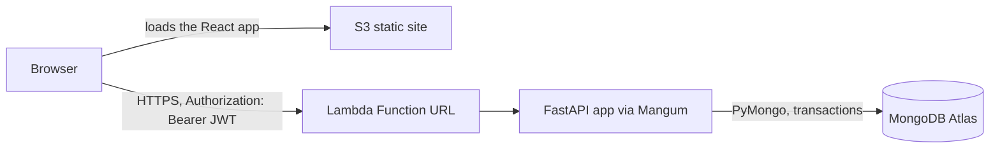

# Architecture

## Purpose

Paper Maker is a small banking back end with a React front end. Customers register, open accounts and move money
between accounts. Bank staff (the ADMIN role) manage everything: customers, accounts, deposits, withdrawals, premium
accounts and the transaction audit. This page explains how the pieces fit together, how a request travels through the
code, and which rules keep the money correct.

## Deployed architecture

The Lambda function is configured with these environment variables:

| Variable | Meaning |
| --- | --- |
| `JWT_SECRET` | Signs and verifies tokens. Required, at least 32 characters, no default. |
| `MONGODB_URI` | Connection string for Atlas. Required. Never printed (it holds the password). |
| `MONGODB_DB` | Database name. Defaults to `paper_maker`. |
| `CORS_ALLOWED_ORIGINS` | Comma-separated browser origins allowed to call the API, such as the S3 site address. |
| `ADMIN_EMAIL`, `ADMIN_PASSWORD` | Optional. If both are set, startup creates this ADMIN login once. The password needs 12 characters or more. |

Optional settings: `JWT_EXPIRATION_MINUTES` (default 60), `LOW_BALANCE_THRESHOLD` (default 100.00) and
`PREMIUM_BALANCE_THRESHOLD` (default 10000.00).

`deploy/lambda_handler.py` wraps the FastAPI app with Mangum for Lambda, and `python deploy/build_lambda.py` builds the
zip (the app plus Linux wheels). The front end is built with `VITE_API_BASE_URL` set to the Function URL and copied to
the S3 bucket (`aws s3 sync frontend/dist s3://<bucket>`). See `deploy/README.md`.

## Request flow

1. The browser sends `POST /api/auth/login` with an email and password. The server checks the scrypt hash and answers
   with an HS256 JWT (`sub` is the user id, `exp` is 60 minutes by default). After 5 failed logins for an email
   (known or not) it answers 429 with `Retry-After` for 15 minutes; the counters live in the `login_attempts`
   collection (`LOGIN_MAX_FAILURES`, `LOGIN_LOCK_MINUTES`).
2. Every later call carries `Authorization: Bearer <token>`.
3. On each request the `authenticate` dependency decodes the token and reloads the user from the `users` collection.
   The role stored in the database is used, not anything in the token, so a disabled user or a changed role takes
   effect at once. A missing, invalid or expired token gives 401.
4. The route checks the role: `Admin` routes answer 403 for a customer; routes a customer may use also check that the
   object is theirs (someone else's customer or account answers 404, so its existence is not revealed).
5. The route calls a service. The service validates the business rules and, for anything that changes data, runs the
   work inside one MongoDB transaction.
6. Repositories do the actual reads and writes, using the transaction's session.

Public routes are `POST /api/auth/register`, `POST /api/auth/login` and `GET /api/public/health`.

## Layers

| Layer | Files | Job |
| --- | --- | --- |
| Routes | `app/main.py` | HTTP paths, request and response models, authentication and role checks, error mapping. |
| Services | `app/services.py`, `app/auth.py` | Business rules: balances, categories, notifications, transfers, registration, login, token handling. Owns the transaction boundaries. |
| Repositories | `app/repositories.py` | One class per collection. Plain MongoDB queries, no business rules. |
| Support | `app/models.py`, `app/money.py`, `app/audit.py`, `app/config.py`, `app/db.py` | Pydantic models, cents conversion, audit cursors, settings, the database connection and indexes. |

## Collections

| Collection | Holds |
| --- | --- |
| `customers` | Name, email, marketing preference, category counter. Email is unique, ignoring letter case. |
| `users` | Logins: email, scrypt password hash, role, linked customer (none for an ADMIN), disabled flag. |
| `accounts` | One document per account, owned by a customer, with `balanceCents`. |
| `transactions` | Every deposit, withdrawal, transfer leg and account closing record. Kept after the account or customer is deleted. |
| `notifications` | Stored messages when a customer's balance category changes. Nothing is emailed or pushed. |

There is no separate audit collection. The audit endpoint reads `transactions` page by page with a cursor.

## Roles

| Capability | ADMIN | CUSTOMER |
| --- | --- | --- |
| Register or log in | yes | yes (registration only creates CUSTOMER) |
| List, search, create, edit, delete customers | yes | no (403) |
| Read a customer record | any | own only |
| Customer's accounts, notifications, marketing preference | any customer | own only |
| List all accounts, premium accounts, edit or delete an account | yes | no (403) |
| Open an account | for any customer | for themself (another customer's id gives 403) |
| Read an account and its transactions | any | own only (others give 404) |
| Deposit and withdraw | yes | no (403) |
| Transfer | from any account | from one of their own accounts to any account (otherwise 403) |
| Transaction audit | yes | no (403) |

## Money rules

- Amounts are stored as whole cents in 64-bit integers (`balanceCents`, `amountCents`). They are converted from and to
  decimal strings such as `"25.00"` at the edge, never as floats. At most two decimals are accepted, and the largest
  balance is 99,999,999.99.
- A deposit, withdrawal or transfer changes the balance and writes its `transactions` record (and any notification) in
  one MongoDB transaction, so they commit together or not at all. The balance update itself is conditional, so a
  withdrawal cannot take an account below zero and a deposit cannot pass the maximum.
- A transfer debits one account and credits another in the same transaction and writes two records
  (`TRANSFER_OUT`, `TRANSFER_IN`) that share a `transferId`.
- Registration creates the customer and the login in one transaction. Deleting a customer removes their accounts and
  login together and records any removed balance as an `ACCOUNT_CLOSED` transaction.
- Deposits, withdrawals and transfers accept an optional `Idempotency-Key` header. A unique index on account and key
  makes the key apply to that account only. Sending the same key with the same request again returns the first result
  without moving money; using it for a different request returns 409.

## Database connection

`get_database` in `app/db.py` creates a `MongoClient` and returns the database. It is called once in the FastAPI
lifespan startup, together with `ensure_indexes`, and the resulting database object is handed to the customer, account
and auth services, which build their repositories from it. Requests reuse that one client. Shutdown closes it.

This is one client per app instance, created at startup, rather than a module-level singleton: importing `app.main`
does not connect, and two app instances (as tests create) each open their own client. On Lambda the handler runs
startup once per cold start, and warm invocations reuse the same client.
