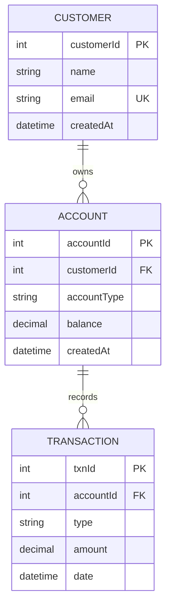
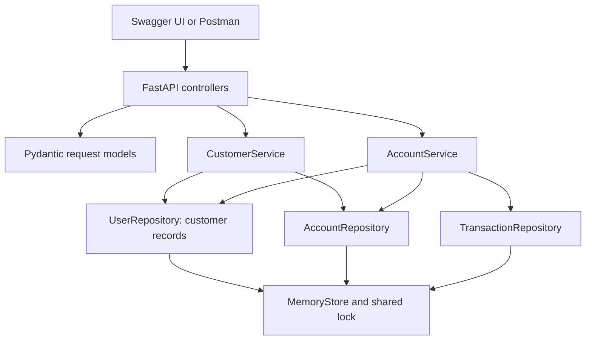

# Customer and account dependencies

- A customer may own zero, one, or many accounts.
- An account must refer to one existing customer; unknown ownership returns 404.
- Each transaction belongs to one account and records a successful deposit or withdrawal.
- Customer deletion is blocked while any account refers to them (409).
- Account deletion requires a zero balance (409 otherwise). It removes the
  account and its in-memory transaction records. Customer and account IDs are
  assigned from counters that keep increasing. Deleting account 1 does not let a
  new account reuse its ID or overwrite another account.
- Account ownership is immutable. Customer names/emails can change without
  changing IDs or ownership. Account display names reflect customer edits.

## Application dependencies

The original project calls customers "users" in its storage model. Both API
names share the same repository and IDs. New clients should use `/api/customers`
and `customerId`; `POST /api/users` and `userId` are compatibility interfaces.

Deposit and withdrawal both use `AccountService._transact`. It checks the balance,
calculates the new amount, and appends a transaction while holding the same lock.
For example, two simultaneous withdrawals cannot both spend the last 100 in an
account: the second request sees the balance left by the first.

Dependencies: FastAPI supplies routing and Swagger, Pydantic validates requests,
Uvicorn serves HTTP, and pytest/HTTPX exercise endpoints. The lock and Decimal
arithmetic are from Python's standard library.
