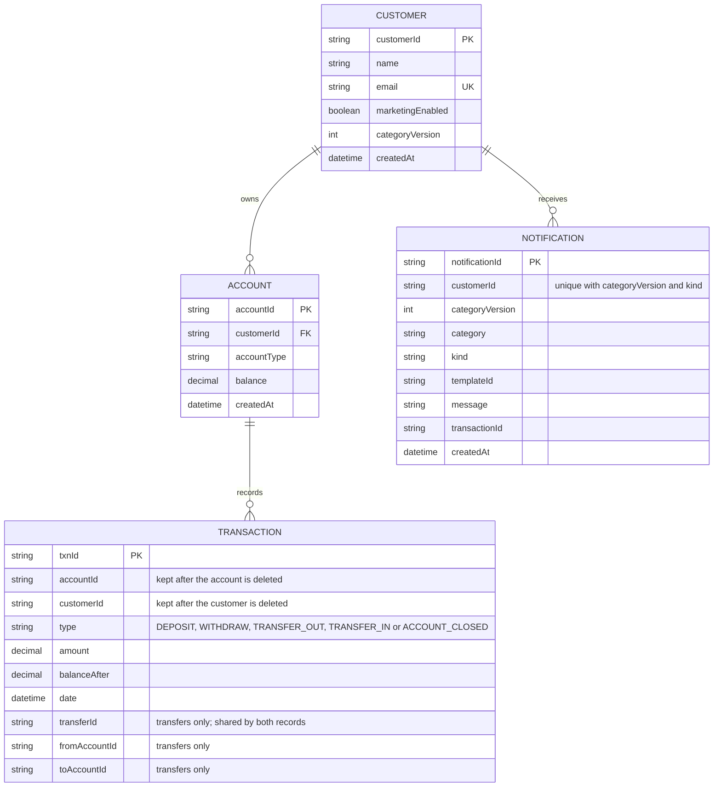
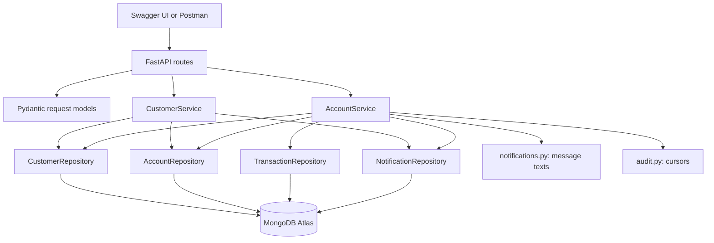

# Customer and account dependencies

IDs are 24-character hexadecimal strings (MongoDB ObjectIds). The database
stores money as whole cents; the API shows decimal strings.

- A customer may own zero, one, or many accounts.
- An account must refer to one existing customer; unknown ownership returns 404.
- Each transaction belongs to one account and records a successful deposit,
  withdrawal or one side of a transfer. It stores both the account ID and the customer ID.
- Deleting a customer deletes all their accounts, whatever the balances, in
  one MongoDB transaction with the customer; an account never outlives its
  owner, and no 409 is returned. The transaction updates the customer's
  document first, so a concurrent account creation or money operation for that
  customer conflicts and retries, then finds the customer or account gone.
  Each account with a balance first gets an `ACCOUNT_CLOSED` transaction
  recording the amount removed. Transactions and notifications are not deleted.
- Account deletion requires a zero balance (409 otherwise), so money is never
  discarded by deleting an account.
- **Transactions are kept** when an account or customer is deleted, including
  for the money that was in a deleted account. Because each
  record carries its own account and customer IDs, it needs no parent record.
  `GET /api/audit/transactions` still returns them for deleted IDs; only
  `GET /api/accounts/{id}/transactions` requires the account to exist (404).
- Notifications are kept the same way when a customer is deleted, but they are
  read through `GET /api/customers/{id}/notifications`, which returns 404 once
  the customer is gone.
- IDs are generated by MongoDB, so a deleted ID is never reused.
- Account ownership is immutable. Customer names/emails can change without
  changing IDs or ownership. Each account stores a copy of its owner's name, and a
  customer edit updates those copies in the same database transaction.

## Application dependencies

The original API called customers "users". `POST /api/users` and `userId` read
and write the same `customers` collection and IDs. New clients should use `/api/customers`
and `customerId`; `POST /api/users` and `userId` are compatibility interfaces.

Deposit and withdrawal both use `AccountService._transact`. In one MongoDB
transaction it looks up an earlier result for the `Idempotency-Key` (if one was
sent), updates the balance with the bound check in the same database operation,
writes the transaction record, and, if the customer's total moved into another
category, counts the change in the customer's `categoryVersion` and stores that
category's messages (marketing only when `marketingEnabled` is true). It also
updates the customer's document first, so concurrent changes to one customer's
accounts, and a preference change, conflict and are retried by the driver;
whichever commits first wins, so a preference change that arrives while a
money operation is in flight applies to later operations. For
example, two simultaneous withdrawals cannot both spend the last 100 in an
account: the second sees the balance left by the first and gets 400.

A transfer (`POST /api/transfers`, `AccountService.transfer`) runs in one
MongoDB transaction. It rejects the same source and destination (422), looks up
an earlier result for the `Idempotency-Key` (scoped to the source account, as
for a withdrawal), reads both accounts (404 if either is missing), and updates
the owning customer documents, each once and in customer ID order, even when
one customer owns both accounts. Those writes serialize the transfer with every
other change to either customer: a conflicting transaction is aborted and
retried by the driver, and the ordering keeps two opposite transfers from
waiting on each other. Each balance update carries its own bound in the same
operation (source at least the amount, destination at most 99999999.99 after
the credit), so a failed bound aborts the whole transaction, undoing the
debit. On success it writes two records that share a new `transferId`:
`TRANSFER_OUT` on the source and `TRANSFER_IN` on the destination (the key is
stored on the OUT record only), each with `fromAccountId`, `toAccountId` and its
own account's `balanceAfter`. A replay finds the OUT record by key, rejects a
different amount or destination with 409, and rebuilds the response from the
two stored records. Category changes are computed per customer: when the two
accounts belong to different customers each one's total can change category and
gets its own `categoryVersion` and messages; between one customer's own
accounts the total is unchanged, so nothing is stored. The `transfer_legs`
partial index on `transferId` finds the other leg of a replay.

`GET /api/accounts/premium` lists accounts whose own balance is at least
`threshold` (default `PREMIUM_BALANCE_THRESHOLD`), highest first, oldest first
among equal balances, up to `limit`. It reads the `balance_desc` index on
`balanceCents` descending, then `_id`. This is per account, unlike the premium
category, which uses the customer's total across accounts.

Settings (`app/config.py`) come from the environment or the `.env` file, and
`app/db.py` opens the connection and creates the indexes at startup.
`CORS_ALLOWED_ORIGINS` is a comma-separated list of browser origins (scheme,
host and optional port; no path, trailing slash or `*`; default
`http://localhost:3000,http://localhost:5173`). A middleware in `app/main.py`
answers CORS requests from those origins, allowing any method and the
`Content-Type` and `Idempotency-Key` request headers; other origins get no CORS
headers. The value is checked at startup, and a bad one stops it.

Dependencies: FastAPI supplies routing and Swagger, Pydantic validates requests,
PyMongo talks to MongoDB, python-dotenv reads the `.env`, Uvicorn serves HTTP,
and pytest/HTTPX exercise endpoints. Decimal arithmetic is from Python's
standard library.
