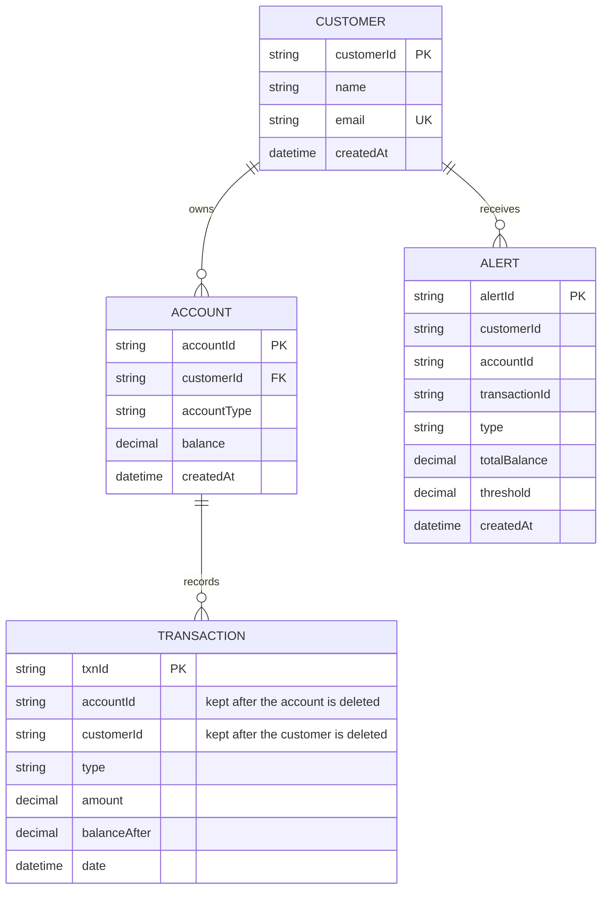
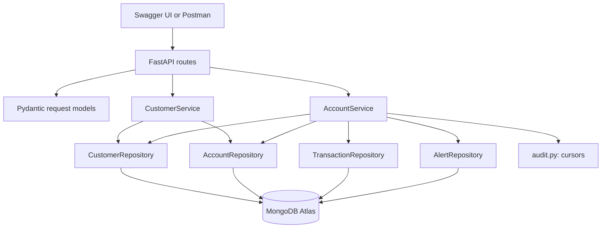

# Customer and account dependencies

IDs are 24-character hexadecimal strings (MongoDB ObjectIds). The database
stores money as whole cents; the API shows decimal strings.

- A customer may own zero, one, or many accounts.
- An account must refer to one existing customer; unknown ownership returns 404.
- Each transaction belongs to one account and records a successful deposit or
  withdrawal. It stores both the account ID and the customer ID.
- Customer deletion is blocked while any account refers to them (409). This is
  why accounts are deleted first: an account must always have an existing
  owner, so the owner cannot be removed while any account still refers to it.
- Account deletion requires a zero balance (409 otherwise), so money is never
  discarded by deleting an account.
- **Transactions are kept** when an account or customer is deleted. Because each
  record carries its own account and customer IDs, it needs no parent record.
  `GET /api/audit/transactions` still returns them for deleted IDs; only
  `GET /api/accounts/{id}/transactions` requires the account to exist (404).
- Alerts are kept the same way, and an alert for an unknown customer ID is just
  an empty list.
- IDs are generated by MongoDB, so a deleted ID is never reused.
- Account ownership is immutable. Customer names/emails can change without
  changing IDs or ownership. Each account stores a copy of its owner's name, and a
  customer edit updates those copies in the same database transaction.

## Application dependencies

The original API called customers "users". `POST /api/users` and `userId` read
and write the same `customers` collection and IDs. New clients should use `/api/customers`
and `customerId`; `POST /api/users` and `userId` are compatibility interfaces.

Deposit and withdrawal both use `AccountService._transact`. In one MongoDB
transaction it looks up an earlier result for the `Idempotency-Key` (if one was
sent), updates the balance with the bound check in the same database operation,
writes the transaction record, and writes an alert if the customer's total
crossed a threshold. It also updates the customer's document, so concurrent
changes to one customer's accounts conflict and are retried by the driver. For
example, two simultaneous withdrawals cannot both spend the last 100 in an
account: the second sees the balance left by the first and gets 400.

Settings (`app/config.py`) come from the environment or the `.env` file, and
`app/db.py` opens the connection and creates the indexes at startup.

Dependencies: FastAPI supplies routing and Swagger, Pydantic validates requests,
PyMongo talks to MongoDB, python-dotenv reads the `.env`, Uvicorn serves HTTP,
and pytest/HTTPX exercise endpoints. Decimal arithmetic is from Python's
standard library.
